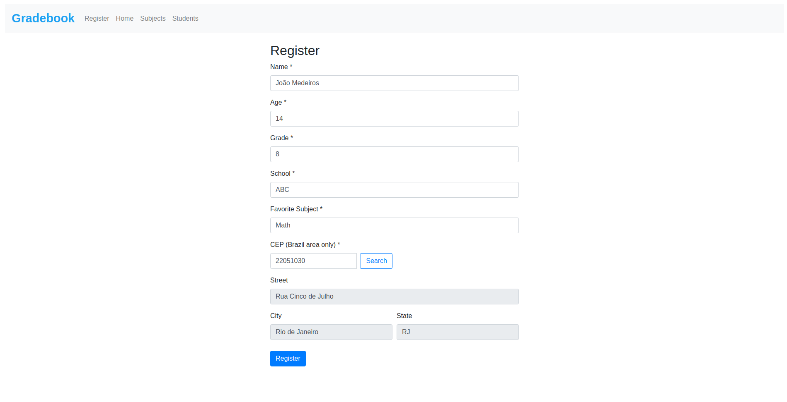
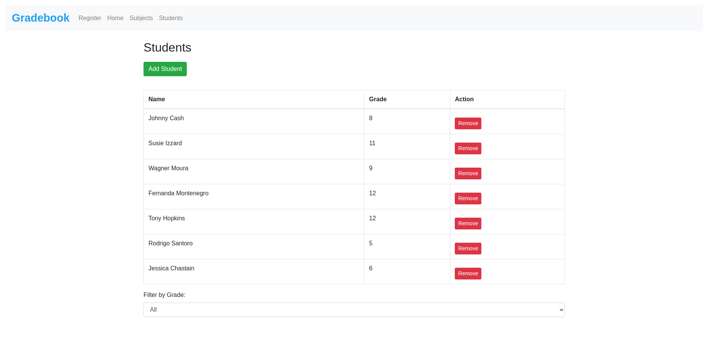

_(English version | [Clique aqui para versão Português-BR](https://github.com/barbaracalderon/gradebook/blob/main/assets/README-pt.md))_


# Gradebook

Gradebook is a simple web application for managing student registration, their grades, and subjects. This project is developed using HTML, CSS, JavaScript, Bootstrap, and localStorage for data storage. This project is part of an individual activity within the Fullstack course curriculum at SENAI/SC by Lab365.



## Author

Barbara Calderon, software developer.

- [Github](https://www.github.com/barbaracalderon)
- [LinkedIn](https://www.linkedin.com/in/barbaracalderondev)
- [Twitter](https://www.x.com/bederoni)


## Features

- **Student Registration**: Add detailed information about students, including name, age, grade, school, and favorite subject.
- **CEP Lookup**: Integration with the ViaCEP API to fetch the address from the CEP (only for Brazil).
- **Subjects Section**: Manage subjects and student grades, with automatic average calculations.
- **Student List**: View all registered students, with the option to filter by grade.


## How to Use

### Student Registration

1. Go to the registration section by clicking on the "Register" tab in the navigation.
2. Fill out the form with the student's information.
3. Click the "Register" button to save the information.

### Navigating Between Sections

- Use the navigation bar at the top to switch between the "Register", "Home", "Subjects", and "Students" sections.

### Managing Subjects

1. Go to the "Subjects" section.
2. Add subjects and grades by clicking the "Add Subject" button.
3. Remove subjects by clicking the "Remove" button next to the subject you want to delete.


### Student List

1. Go to the "Students" section.
2. Add a new student by clicking the "Add Student" button.
3. Remove a student by clicking the "Remove" button next to the student you want to delete.
4. Filter students by grade using the dropdown menu.




## Technologies Used

- **HTML**: Structure of the page.
- **CSS**: Styling of the page.
- **JavaScript**: Functionality of the page.
- **Bootstrap**: Responsive styles and components.
- **localStorage**: Data storage in the browser.
- **ViaCEP API**: Fetching addresses from CEP.

## Project Structure

- `index.html`: Main HTML file.
- `styles.css`: Custom styles file.
- `script.js`: JavaScript scripts file.
- `README.md`: This file.
- `assets/`: Directory for images and PT readme.md version.

## How to Run the Project

1. Clone this repository.
   ```bash
   git clone https://github.com/barbaracalderon/gradebook.git
   ```

2. Open the `index.html` file in your preferred browser.

## Contributions

Contributions are welcome! Feel free to open issues and pull requests for improvements and bug fixes.

## Final Considerations

This project was undertaken for educational purposes, allowing practice with Bootstrap, localStorage, and JavaScript, all without the use of frameworks. The goal was to create an appealing and clean visual interface while practicing essential web development skills.

I hope this project helps others in understanding more about these technologies. By examining the code and the structure of this application, learners can gain insights into the practical application of HTML, CSS, JavaScript, and Bootstrap for creating dynamic and responsive web applications.

This project serves as a useful reference for anyone looking to understand how to implement localStorage for data persistence, manage student information, and dynamically update the user interface. I encourage anyone interested in the subject to study this project, experiment with the code, and return to it whenever they need a refresher or inspiration for their own projects.

Happy coding.

Barbara Calderon.
