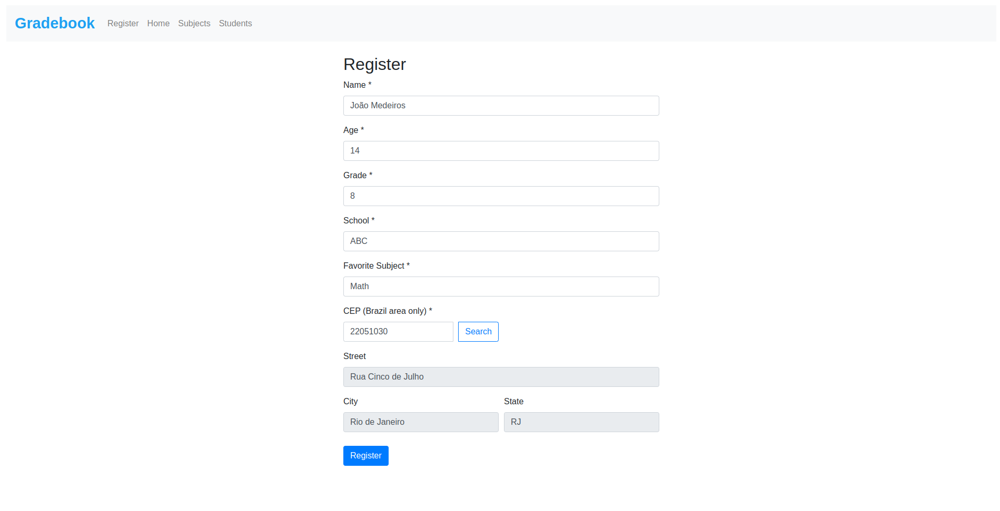
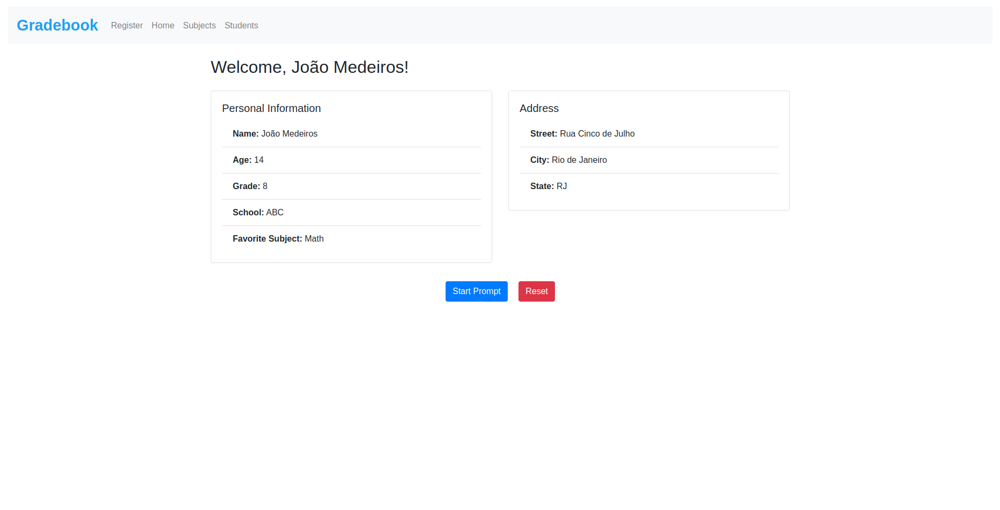
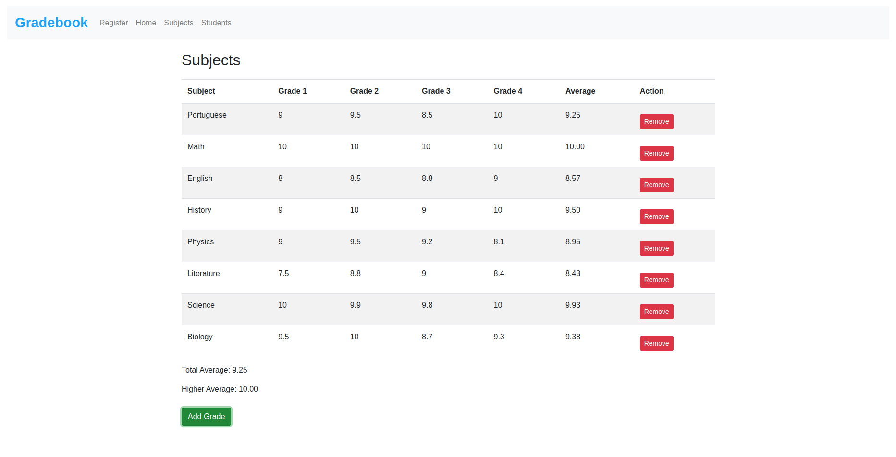
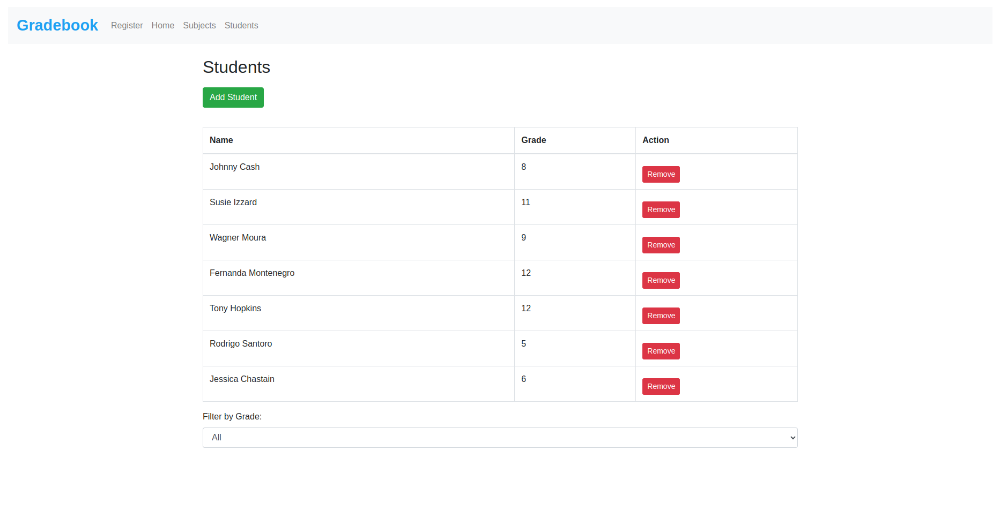

_(Versão português. | [Clique aqui para versão Inglês-EN]()_

# Gradebook

Gradebook é uma aplicação web simples para gerenciar o registro de alunos, suas notas e disciplinas. Este projeto foi desenvolvido usando HTML, CSS, JavaScript, Bootstrap e localStorage para armazenamento de dados. Este projeto faz parte de uma atividade individual dentro do currículo do curso Fullstack do SENAI/SC pelo Lab365.



## Autor

Barbara Calderon, desenvolvedora de software.

- [Github](https://www.github.com/barbaracalderon)
- [LinkedIn](https://www.linkedin.com/in/barbaracalderondev)
- [Twitter](https://www.x.com/bederoni)

## Funcionalidades

- **Registro de Alunos**: Adicione informações detalhadas sobre os alunos, incluindo nome, idade, série, escola e matéria favorita.
- **Consulta de CEP**: Integração com a API ViaCEP para buscar o endereço a partir do CEP (apenas para o Brasil).
- **Seção de Disciplinas**: Gerencie disciplinas e notas dos alunos, com cálculos automáticos de média.
- **Lista de Alunos**: Veja todos os alunos registrados, com a opção de filtrar por série.



## Como Usar

### Registro de Alunos

1. Vá para a seção de registro clicando na aba "Registrar" na navegação.
2. Preencha o formulário com as informações do aluno.
3. Clique no botão "Registrar" para salvar as informações.

### Navegando Entre Seções

- Use a barra de navegação no topo para alternar entre as seções "Registrar", "Início", "Disciplinas" e "Alunos".

### Gerenciamento de Disciplinas

1. Vá para a seção "Disciplinas".
2. Adicione disciplinas e notas clicando no botão "Adicionar Disciplina".
3. Remova disciplinas clicando no botão "Remover" ao lado da disciplina que você deseja excluir.



### Lista de Alunos

1. Vá para a seção "Alunos".
2. Adicione um novo aluno clicando no botão "Adicionar Aluno".
3. Remova um aluno clicando no botão "Remover" ao lado do aluno que você deseja excluir.
4. Filtre os alunos por série usando o menu suspenso.



## Tecnologias Utilizadas

- **HTML**: Estrutura da página.
- **CSS**: Estilização da página.
- **JavaScript**: Funcionalidade da página.
- **Bootstrap**: Estilos e componentes responsivos.
- **localStorage**: Armazenamento de dados no navegador.
- **ViaCEP API**: Busca de endereços a partir do CEP.

## Estrutura do Projeto

- `index.html`: Arquivo HTML principal.
- `styles.css`: Arquivo de estilos personalizados.
- `script.js`: Arquivo de scripts JavaScript.
- `README.md`: Este arquivo.
- `assets/`: Diretório para imagens e versão em PT do readme.md.

## Como Executar o Projeto

1. Clone este repositório.
   ```bash
   git clone https://github.com/your-username/gradebook.git
    ```

2. Abra o arquivo `index.html` no seu navegador de escolha.


## Contribuições

Contribuições são bem-vindas! Sinta-se à vontade para abrir issues e pull requests para melhorias e correções de bugs.

## Considerações Finais

Este projeto foi realizado por razões educacionais, permitindo a prática com Bootstrap, localStorage e JavaScript, tudo sem o uso de frameworks. O objetivo foi criar uma interface visual atraente e limpa, enquanto se praticam habilidades essenciais de desenvolvimento web.

Espero que este projeto ajude outras pessoas a entenderem mais sobre essas tecnologias. Ao examinar o código e a estrutura desta aplicação, os aprendizes podem obter insights sobre a aplicação prática de HTML, CSS, JavaScript e Bootstrap para criar aplicações web dinâmicas e responsivas.

Este projeto serve como uma referência útil para qualquer pessoa que queira entender como implementar o localStorage para persistência de dados, gerenciar informações de alunos e atualizar dinamicamente a interface do usuário. Incentivo qualquer pessoa interessada no assunto a estudar este projeto, experimentar o código e voltar a ele sempre que precisar de uma atualização ou inspiração para seus próprios projetos.

Bons códigos!

Barbara Calderon.